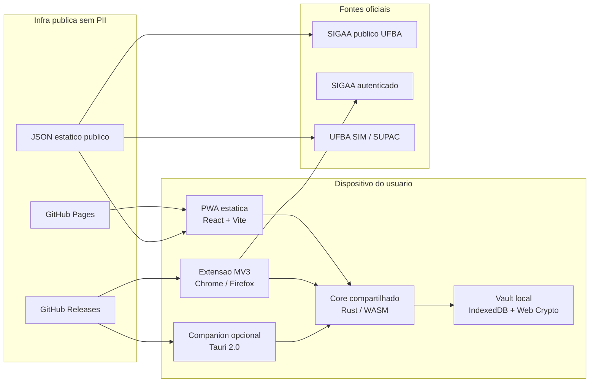
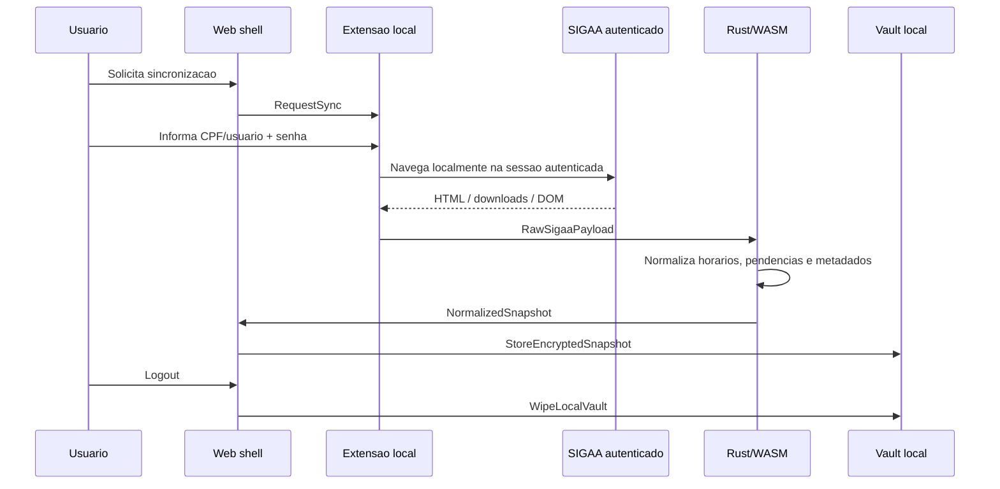
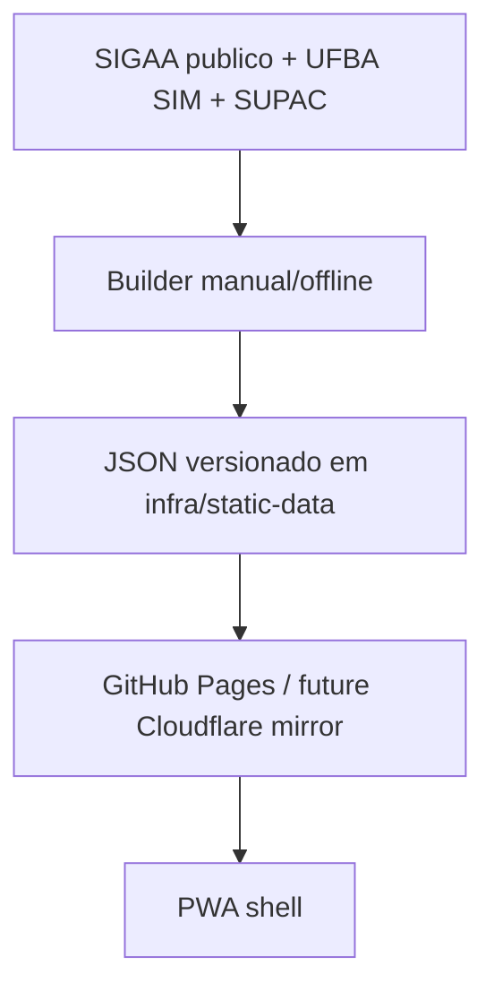

# Arquitetura Formae v0

## Resumo

Formae nasce como uma PWA estatica publicada no GitHub Pages, com toda integracao privada acontecendo no dispositivo do usuario. O shell web nao recebe credenciais do SIGAA nem persiste snapshots academicos no servidor. A normalizacao, os contratos de dominio e o parsing de horarios ficam no core em Rust, compartilhado com WebAssembly no navegador e com futuros runtimes locais.

## Componentes e fronteiras de confianca

## Fluxo privado de sincronizacao

## Fluxo publico de catalogo

## Dominio canonico

- `StudentSnapshot`: snapshot academico privado ja normalizado.
- `CurriculumStructure`: grade canonica, componentes, equivalencias e pre-requisitos.
- `Course`: metadados do curso.
- `Component`: unidade curricular.
- `PrerequisiteRule`: expressao de pre-requisito.
- `Equivalence`: relacao de equivalencia.
- `ScheduleBlock`: codigo bruto + codigo canonico + meetings.
- `PendingRequirement`: pendencia ou requisito ainda nao concluido.
- `IssuedDocumentMetadata`: metadados de historico, declaracao, atestado e similares.

## Modelo de ameacas inicial

| Ameaca | Severidade | Mitigacao v0 |
| --- | --- | --- |
| Vazamento de credenciais do SIGAA | Alta | Uso apenas em memoria pela extensao; sem envio para backend; wipe por sessao |
| XSS no shell web | Alta | Conteudo estatico, CSP futura, contratos tipados e sem HTML arbitrario vindo do SIGAA |
| Permissoes excessivas da extensao | Alta | MV3 com minimo de host permissions, escopo por origem e seletor versionado |
| Drift de seletores e markup do SIGAA | Alta | Fixtures publicas, testes de replay, alarmes de contrato e versionamento de seletores |
| Supply chain em JS | Media | Dependencias pequenas, lockfile, Biome, CI estrita e Rust para regras centrais |
| Supply chain em Rust | Media | Workspace pequeno, `cargo clippy`, `cargo fmt --check`, revisao de crates antes de ampliar superficie |
| Persistencia indevida de snapshots | Media | IndexedDB cifrado, wipe manual e por logout, sem sincronizacao remota |
| Telemetria invasiva | Media | Nada por padrao; apenas tecnica, anonimizada e opt-in no futuro |

## Seletor, fixture e contrato

- Fixtures publicas ficam em `fixtures/public/`.
- O crate `formae-test-fixtures` expõe HTML imutavel para testes de replay.
- O parser nunca "corrige silenciosamente": qualquer canonicalizacao gera warning.
- O runtime privado futuro deve tratar seletores como dados versionados, nao hardcodes espalhados.

## Deploy e operacao

- Primario: GitHub Pages para o shell web.
- Artefatos futuros: GitHub Releases para extensao e companion.
- Alternativa documentada: Cloudflare Pages como espelho posterior.
- Fora de escopo da v0: servidor Rust persistente para PII.

## Fontes publicas tratadas como oficiais

- SIGAA publico da UFBA: `https://sigaa.ufba.br/`
- UFBA SIM sobre horarios do SIGAA: `https://ufbasim.ufba.br/hor%C3%A1rios-de-aula-c%C3%B3digos-na-tabela-de-hor%C3%A1rios-do-sigaa`
- IHAC/UFBA com faixas de horario: `https://ihac.ufba.br/pt/10212/`
- SUPAC para guias operacionais e documentos

